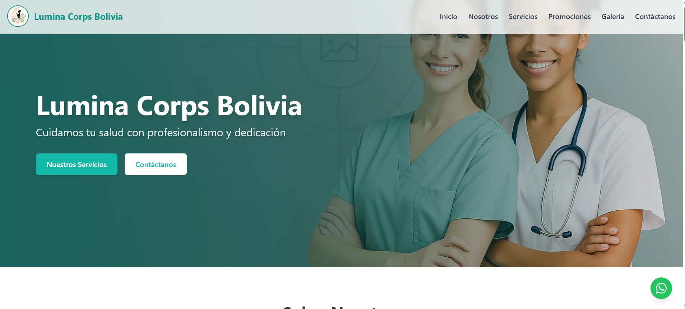

# 🌟 Lumina Web Demo

> Versión de prueba del sitio web oficial de **Lumina Corps**, clínica de fisioterapia, rehabilitación y bienestar integral.

Este proyecto está desarrollado con tecnologías modernas como **React**, **Vite** y **Tailwind CSS**, y presenta una estructura visual optimizada para clínicas de salud con enfoque humano y profesional.

---

## 🖼️ Vista previa



---

## 🚀 Tecnologías utilizadas

- ⚛️ [React](https://reactjs.org/)
- ⚡ [Vite](https://vitejs.dev/)
- 🎨 [Tailwind CSS](https://tailwindcss.com/)
- 🌍 [WebP optimizado para imágenes]
- 🔗 [WhatsApp Contact Button](https://wa.me/59161624615)

---

## 📦 Instalación y ejecución local

1. Clona el repositorio:

```bash
git clone https://github.com/tu-usuario/lumina-web-demo.git
cd lumina-web-demo
